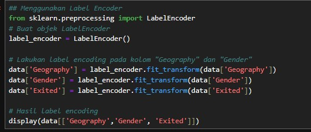
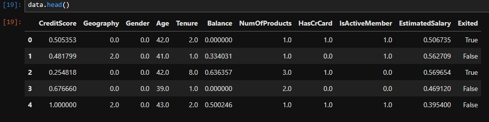
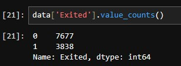
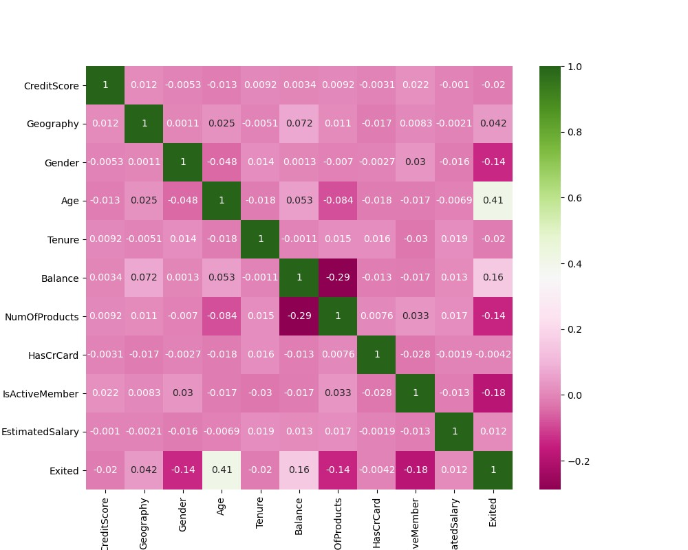

# Team Predictive Pioneers

## STAGE 2 Homework Data Preprocessing

## 1. Data Cleansing 

Berdasarkan eksplorasi awal, dataset ini berisi beberapa fitur tentang pelanggan sebuah bank, dan kolom target "Exited" yang menunjukkan apakah pelanggan tersebut churn (bernilai 1) atau tidak (bernilai 0).

**Fitur-fitur yang tersedia di dataset ini meliputi :**

1. **RowNumber** : Nomor baris
2. **CustomerId** : ID pelanggan
3. **Surname** : Nama belakang pelanggan
4. **CreditScore** : Skor kredit pelanggan
5. **Geography** : Negara asal pelanggan
6. **Gender** : Jenis kelamin pelanggan
7. **Age** : Umur pelanggan
8. **Tenure** : Lamanya pelanggan menjadi nasabah bank
9. **Balance** : Saldo rekening pelanggan
10. **NumOfProducts** : Jumlah produk yang dimiliki pelanggan di bank
11. **HasCrCard** : Apakah pelanggan memiliki kartu kredit (1 = Ya, 0 = Tidak)
12. **IsActiveMember** : Apakah pelanggan aktif (1 = Ya, 0 = Tidak)
13. **EstimatedSalary** : Gaji estimasi pelanggan
14. **Exited** : Apakah pelanggan churn (1 = Ya, 0 = Tidak)

**A. Handle Missing Values**

Hasil diatas menjawab pertanyaan bahwa tidak ada nilai yang hilang di setiap kolom. Oleh karena itu, tidak perlu mengambil tindakan apa pun terkait dengan nilai yang hilang atau menggunakan metode lain untuk memanipulasi keluaran isnull() dan menggunakan fungsi sebaliknya, notna(), yang mengembalikan jumlah nilai yang terisi dalam kerangka data.

**B. Handle Duplicated Data**

**Penjelasan dari Handle Duplicated Data:** 
    
Tidak ada baris yang duplikat dalam dataset ini. Oleh karena itu, kita tidak perlu mengambil tindakan apa pun terkait dengan data duplikat Kemudian, kita akan lanjutkan ke langkah 

**C. Handle Outliers**
    
Kita akan fokus pada fitur numerik untuk memeriksa adanya outlier. Untuk memudahkan identifikasi, kita akan menggunakan visualisasi berupa boxplot.


**Dari boxplot di atas, kita dapat mengamati beberapa hal :**

1. **CreditScore** : Terdapat beberapa nilai yang lebih rendah daripada whisker bawah, yang dapat dianggap sebagai outlier.
2. **Age** : Terdapat beberapa nilai yang lebih tinggi daripada whisker atas, yang dapat dianggap sebagai outlier.
3. **Tenure** : Tidak tampak adanya outlier.
4. **Balance** : Tidak tampak adanya outlier.
5. **NumOfProducts** : Terdapat beberapa nilai yang lebih tinggi daripada whisker atas, yang dapat dianggap sebagai outlier.
6. **EstimatedSalary** : Tidak tampak adanya outlier.

Meskipun kita dapat mengidentifikasi beberapa outlier, keputusan untuk menanganinya tergantung pada konteks bisnis dan tujuan analisis. Dalam banyak kasus, outlier mungkin mengandung informasi yang penting. Sebagai contoh, dalam analisis churn, pelanggan dengan perilaku yang "tidak biasa" (mis. skor kredit yang sangat rendah atau usia yang sangat tinggi) mungkin justru adalah segmen yang penting untuk dipahami. Tetapi, outlier bisa saja mengakibatkan model yang akan dibuat menghasilkan hasil yang kurang memuaskan.

Untuk saat ini, kami akan mengatasi outlier tersebut dengan menggunakan metode interquantile range (IQR) untuk mengurangi outlier yang ada.


**D. Feature Transformation**

Transformasi fitur dapat meningkatkan performa model dengan mengubah distribusi atau skala data. Beberapa metode transformasi populer meliputi normalisasi, standarisasi, dan transformasi logaritmik. Pertama, kita lihat distribusi dari fitur numerik untuk memutuskan apakah transformasi diperlukan.


**Berdasarkan histogram di atas :**

1. **CreditScore** : Distribusi tampaknya mendekati normal.
2. **Age** : Distribusi sedikit condong ke kanan.
3. **Tenure** : Distribusi tampak multi-modal, dengan beberapa puncak.
4. **Balance** : Terdapat dua puncak, salah satunya di nol yang menunjukkan banyak pelanggan dengan saldo nol.
5. **NumOfProducts** : Distribusi adalah kategorikal dengan beberapa nilai yang dominan.
6. **EstimatedSalary** : Distribusi tampaknya seragam.

Pada Feature-Feature yang memiliki rentang yang jauh kami melakukan transformasi feature menggunakan minmaxscaler untuk mengubah rentang datanya menjadi 0-1 tujuan nya agar model yang nantinya kami buat dapat menghasilkan nilai yang optimal.


**E. Feature Encoding**

Encoding adalah proses konversi fitur kategorikal menjadi format yang dapat dimengerti oleh algoritma machine learning. Kita akan memeriksa tipe data dari setiap kolom dan menentukan apakah ada fitur kategorikal yang perlu di-encode.

**Berdasarkan tipe data, kita memiliki beberapa fitur kategorikal :**

1. **Surname**
2. **Geography**
3. **Gender**

Namun, Surname adalah fitur yang unik untuk setiap pelanggan dan mungkin tidak memiliki kegunaan dalam prediksi churn. Oleh karena itu, kolom ini dihapus pada awal pengolahan data.

Untuk fitur Geography dan Gender, kita perlu melakukan encoding. Ada berbagai metode encoding seperti One-Hot Encoding, Label Encoding, dan lainnya. Untuk tujuan ini, kita akan menggunakan Label Encoding.



Setelah melakukan label encoding terhadap 3 kolom categorik yang penting, kami mendapatkan hasil dibawah ini :

Pada kolom **Geography :** 0 = Germany; 1 = France; 2 = Spain.

Pada kolom **Gender :** 1 = Male; 0 = Female.

Pada kolom **Exited :** 0 = No; 1 = Yes.

Fitur Geography dan Gender telah di-encode menggunakan Label Encoding. Selanjutnya, kita akan melanjutkan ke langkah F. Handle Class Imbalance. Kita akan memeriksa distribusi kelas target (Exited) untuk melihat apakah ada ketidakseimbangan kelas yang perlu diatasi.

**Distribusi kelas target (Exited) adalah sebagai berikut :**


1. Kelas **0** (Tidak Churn): 80.23%
2. Kelas **1** (Churn): 19.76%

Terdapat ketidakseimbangan kelas di mana kelas 0 memiliki representasi yang jauh lebih tinggi dibandingkan dengan kelas 1. Ketidakseimbangan ini dapat mempengaruhi performa model, terutama dalam menilai kelas minoritas.

**Ada beberapa metode untuk menangani ketidakseimbangan kelas, seperti :**

1. **Resampling:** Teknik ini melibatkan penambahan atau pengurangan sampel dari kelas tertentu untuk mencapai distribusi yang lebih seimbang.
2. **Menggunakan metrik evaluasi yang tepat:** Akurasi mungkin bukan metrik yang ideal dalam kasus ketidakseimbangan kelas. Metrik lain seperti F1-score, AUC-ROC, atau precision dan recall mungkin lebih informatif.
3. **Penggunaan algoritma yang mendukung penimbangan kelas:** Beberapa algoritma memungkinkan penimbangan kelas saat pelatihan, yang memberikan penalti lebih tinggi untuk kesalahan pada kelas minoritas.
4. **Penggunaan teknik ensemble seperti Random OverSampling Boost (ROSB) atau Synthetic Minority Over-sampling Technique (SMOTE).**

Keputusan tentang bagaimana menangani ketidakseimbangan kelas tergantung pada tujuan analisis dan model yang akan digunakan. Jika kita ingin fokus pada identifikasi pelanggan yang mungkin churn (kelas 1), maka mungkin perlu mempertimbangkan resampling atau teknik lain untuk meningkatkan sensitivitas model terhadap kelas tersebut.

Untuk saat ini, asumsi kita akan menggunakan algoritma yang mendukung penimbangan kelas dan metrik evaluasi yang sesuai saat pelatihan model.

**F. Handle Class Imbalance**

Ketidakseimbangan kelas akan di-handle dengan menggunakan algoritma yang mendukung penimbangan kelas dan metrik evaluasi yang tepat. Resampling dilakukan dengan menetapkan threshold 0.5 untuk memperbanyak label yes.


## 2. Feature Engineering

### A.) Feature selection (membuang feature yang kurang relevan atau redundan

**Source code import library :**
```code
import pandas as pd
import numpy as np
import matplotlib.pyplot as plt
import seaborn as sns
import warnings
warnings.filterwarnings('ignore')
```

**Baca dataset :**
```code
data = pd.read_csv(r'D:\FILE_IRFAN_KARIM\Rakamin DS MSIB\Tugas\Homework Week 11\Homework/Churn_Fix.csv')
data.head()
```



Pada data diatas, sebelumnya kami sudah membuang beberapa kolom yang tidak terlalu dibutuhkan seperti (Surname, CustomerId dan RowNumber) sehingga total kolom nya sekarang hanya ada 11.

Karena kolom Exited masih berupa nilai categorik kita ubah menjadi numerik terlebih dahulu

**Menggunakan Label Encoder**
```code
from sklearn.preprocessing import LabelEncoder
```

**#Buat objek LabelEncoder**
```code
label_encoder = LabelEncoder()
data['Exited'] = label_encoder.fit_transform(data['Exited'])
```

**Hasil dari encoding**


**0 = NO , 1 = YES**

Sebelum kita memasuki seleksi fitur ada baiknya kita melihat korelasi antar fitur terlebih dahulu dengan menggunakan heatmap agar lebih jelas.

**Cek korelasi dengan tabel :**
```code
data.corr(method='pearson')
```

**Cek korelasi menggunakan heatmap :**
```code
cek_corr = data.corr()
plt.figure(figsize=(10,8))
sns.heatmap(cek_corr, cmap='PiYG', annot=True)
plt.show()
```



**Insight Feature Selection:**

Dapat dilihat pada visualisasi diatas, tidak ditemukannya fitur yang redundan. Artinya kita tidak perlu membuang suatu fitur, fitur-fitur di dalam dataset ini bisa dipakai dan tinggal menambahkan feature baru agar bisa mengambil insight lebih banyak dari dataset ini.


### B.) Feature extraction (membuat feature baru dari feature yang sudah ada)

```code
data['Balance_to_EstimatedSalary'] = data['Balance'] / data['EstimatedSalary']
data['Age_to_Tenure'] = data['Age'] / data['Tenure']
data['CreditScore_to_Age'] = data['CreditScore'] / data['Age']
data['CreditScore_to_Balance'] = data['CreditScore'] / (data['Balance'] + 1)
data['NumOfProducts_to_Age'] = data['NumOfProducts'] / data['Age']
```

**Penjelasan fitur yang dibuat :**

**1. Balance_to_EstimatedSalary :** Fitur ini menghitung rasio antara saldo rekening pelanggan dan gaji estimasi pelanggan. Ini dapat memberikan indikasi seberapa besar persentase dari gaji pelanggan yang disimpan di rekening bank. Fitur ini mungkin berguna untuk mengidentifikasi pola-pola yang berkaitan dengan besarnya saldo rekening relatif terhadap gaji.

**2. Age_to_Tenure :** Fitur ini menghitung rasio antara usia pelanggan dan lamanya pelanggan menjadi nasabah bank. Ini mencoba mengukur seberapa lama pelanggan telah menjadi nasabah dalam konteks usianya. Hal ini bisa membantu dalam memahami apakah pelanggan yang lebih muda atau lebih tua cenderung menjadi pelanggan baru atau setia.

**3. CreditScore_to_Age :** Fitur ini menghitung rasio antara skor kredit pelanggan dan usia pelanggan. Ini mencoba melihat hubungan antara skor kredit dan usia, apakah skor kredit cenderung berbeda antara kelompok usia yang berbeda.

**4. CreditScore_to_Balance :** Fitur ini menghitung rasio antara skor kredit pelanggan dan saldo rekening pelanggan. Ini dapat memberikan gambaran tentang apakah ada korelasi antara skor kredit dan seberapa banyak uang yang disimpan di rekening.

**5. NumOfProducts_to_Age :** Fitur ini menghitung rasio antara jumlah produk yang dimiliki pelanggan dan usia pelanggan. Ini bisa membantu dalam memahami sejauh mana pelanggan yang lebih muda atau lebih tua cenderung memiliki lebih banyak produk perbankan.

**Cek korelasi setelah adanya fitur baru :**
```code
cek_after_engineering = data.corr()
plt.figure(figsize=(15,15))
sns.heatmap(cek_after_engineering, annot=True)
```


Dapat dilihat bahwa masih ada feature yang redundan dari hasil fitur engineering. Maka dari itu, kami akan mempertimbangkan apakah tetap akan memakai fitur tersebut atau dihapus saja.
# STAGE-2

